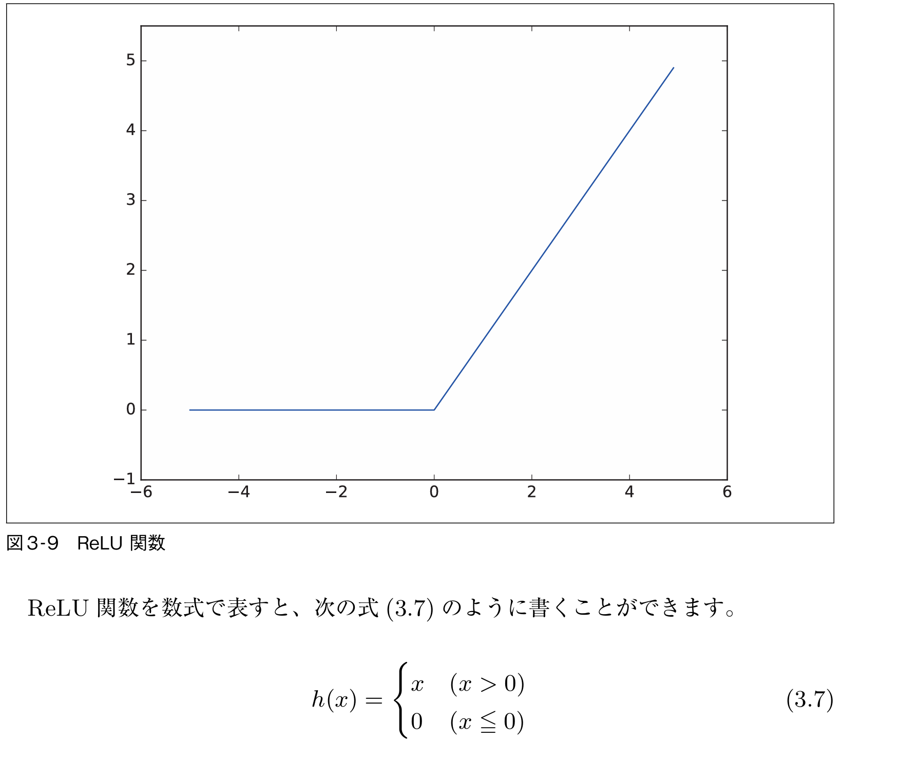
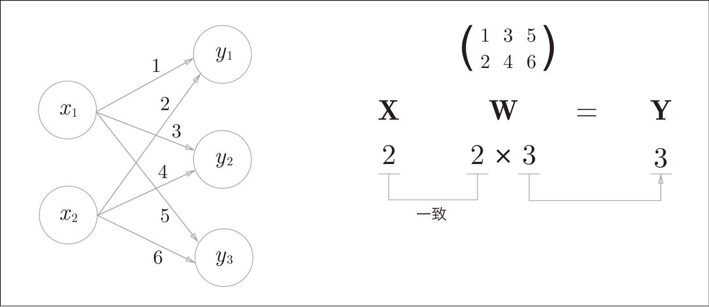
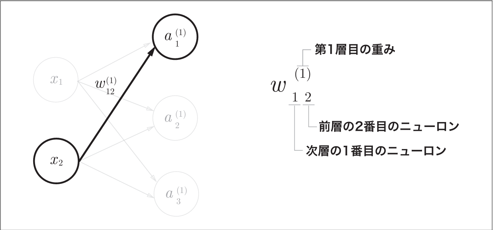
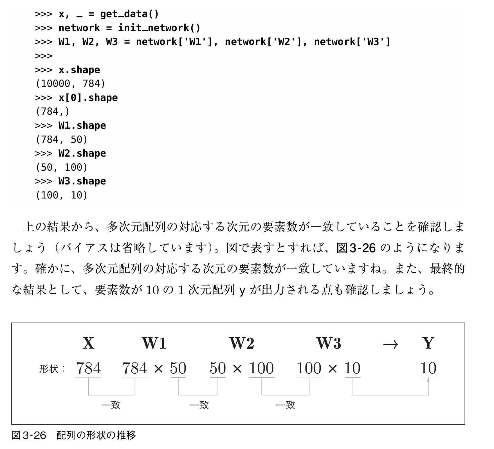
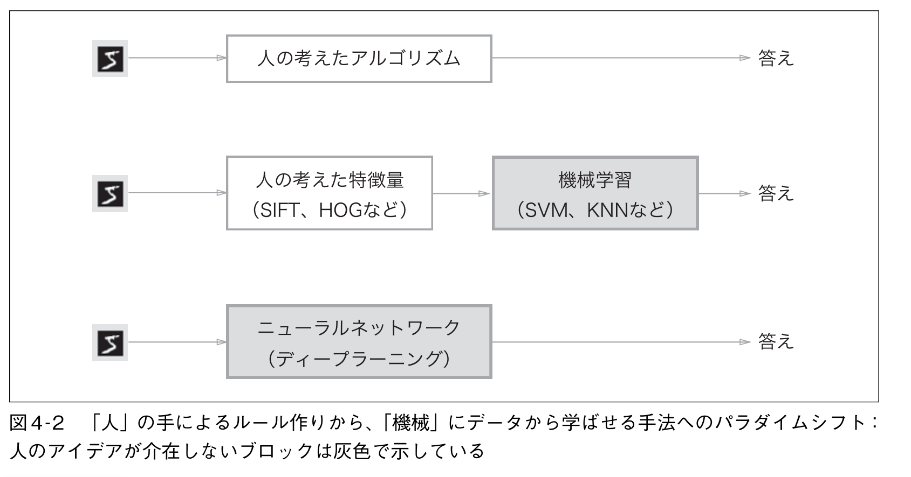
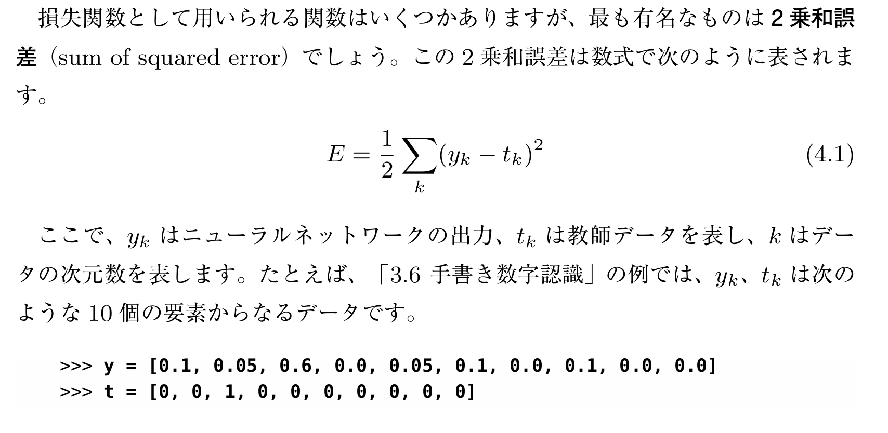

# 从零开始的深度学习笔记
## 1.multi-layered perceptron

看上去是3层构造，但是实际上只有两层有权重，所以是2层感知机。
## 2.sigmoid function

## 3.sigmoid函数图像

線形関数の問題点は、どんなに層を深くしても、それと同じことを行う「隠れ層のないネットワーク」が必ず存在する、という事実に起因します。
## 4.ReLU函数

NumPyのmaximumという関数を使っています。このmaximumは、入力された値から大きいほうの値を選んで出力する関数です。
## 5.神经网络

这里需要注意的是，numpy里的1维行列可以看作行，也可以看作列，来进行计算。

**从后神经元往前对应是行列的列，从前神经元往后对应是行列的行**
机器学习中的问题可以大致分类为回归问题和分类问题，回归问题比如说从人物图像中预测这个人的体重等一系列的数值。
**分类问题使用softmax函数**
## 6.softmax函数

ソフトマックスの指数関数の計算を行う際には、何らかの定数を足し算（もしくは、引き算）しても結果は変わらない、ということです。

**对于输入ak（n个数），加上任意常数，不改变结果**

ここでC′にはどのような値を用いることもできますが、オーバーフローの対策としては、入力信号の中で最大の値を用いることが一般的です。

**一般情况下在模型推论时，会省略softmax函数。那为什么要在输出层使用softmax函数呢？ 原因与模型学习时有关。** 

输出层的个数 = 分类问题中类别的个数

## 7.MNISTデータセット
load_mnist 関数は、「(訓練画像, 訓練ラベル), (テスト画像, テストラベル)」という形式で、読み込んだMNISTデータを返します。また、引数として、load_mnist(normalize=True, flatten=True, one_hot_label=False) のように、3つの引数を設定することができます。
**第一个参数可以把画像的像素通道正则化0到1之间**
normalize をTrue に設定すると、その関数の内部では画像の各ピクセルの値を255で除算し、データの値が0.0～1.0の範囲に収まるように変換されます。このようなデータをある決まった範囲に変換する処理を正規化（normalization）と言います。
**第二个参数可以把画像的1x28x28的三维矩阵化为784的一维矩阵**
**第三个参数可以把图像标签转换为one-hot形式，这个形式可以把2转换成【0，0，1，0，0，0，0，0，0，0】**

**加载这个数据集的时候，要把当前工作目录设置在运行脚本这个目录上，然后使用代码把上一级的目录加入到查找路径中，这样才能正确导入dataset这个文件里的mnist.py**

## 8.批处理

バッチ処理には、コンピュータで計算する上で大きな利点があります。それは、バッチ処理によって、1枚あたりの処理時間を大幅に短縮できるという利点です。なぜ処理時間を短縮できるかというと、値計算を扱うライブラリの多くは、大きな配列の計算を効率良く処理できるような高度な最適化が行われているからです。また、ニューラルネットワークの計算において、データ転送がボトルネックになる場合は、バッチ処理を行うことで、バス帯域の負荷を軽減することができます **（正確には、データの読み込みに対して演算の割合を多くすることができます）**。つまり、バッチ処理を行うことで大きな配列の計算を行うことになりますが、大きな配列を一度に計算するほうが、分割した小さい配列を少しずつ計算するよりも速く計算が完了するのです。

## 9.从数据中学习
そのひとつの方法としては、画像から特徴量を抽出して、その特徴量のパターンを機械学習の技術で学習する方法が考えられます。ここで言う特徴量とは、入力データ（入力画像）から本質的なデータ（重要なデータ）を的確に抽出できるように設計された変換器を指します。

## 10.  2乗和誤差
