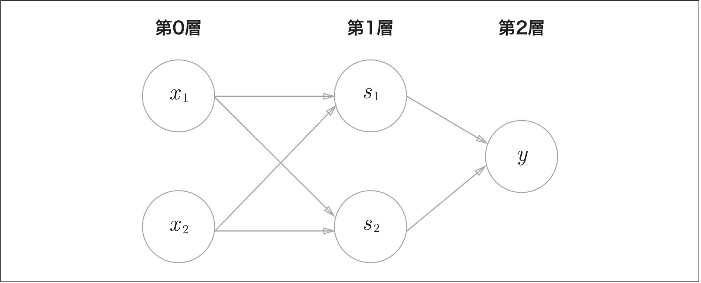
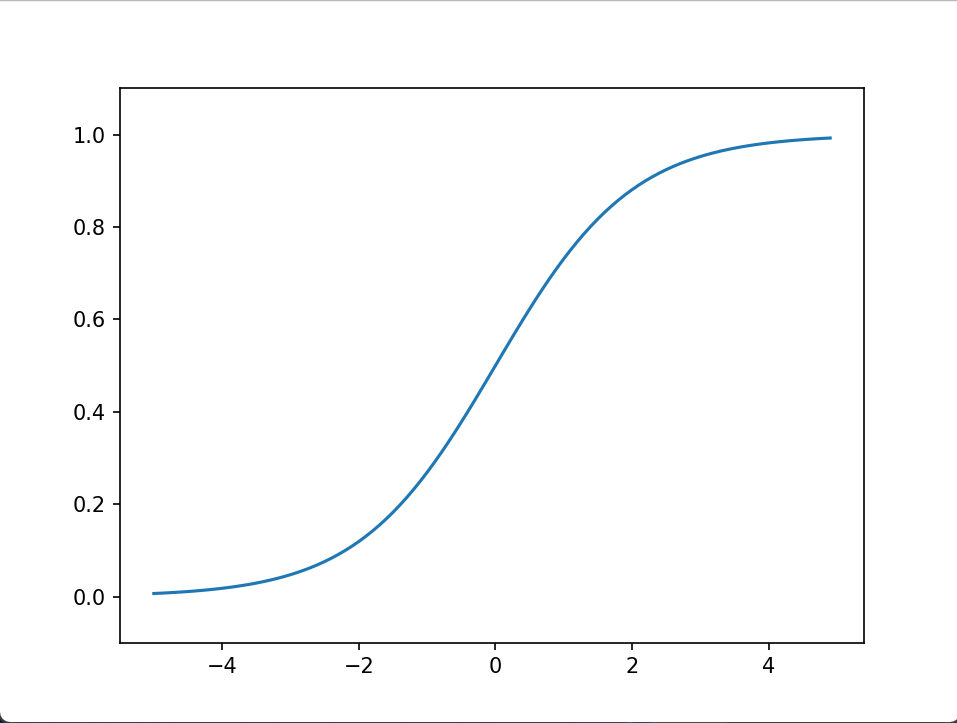
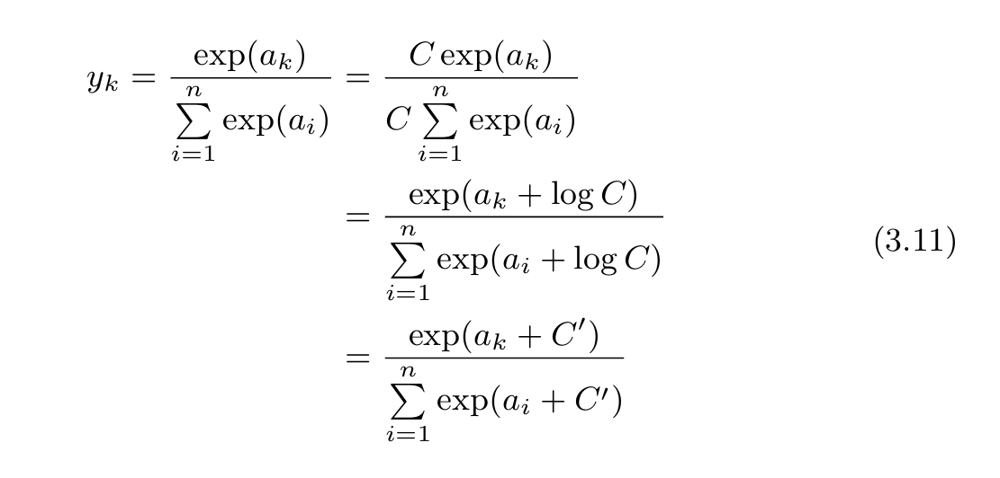

# 从零开始的深度学习笔记
## 1.multi-layered perceptron

看上去是3层构造，但是实际上只有两层有权重，所以是2层感知机。
## 2.sigmoid function

## 3.sigmoid函数图像

線形関数の問題点は、どんなに層を深くしても、それと同じことを行う「隠れ層のないネットワーク」が必ず存在する、という事実に起因します。
## 4.ReLU函数
NumPyのmaximumという関数を使っています。このmaximumは、入力された値から大きいほうの値を選んで出力する関数です。
## 5.神经网络

这里需要注意的是，numpy里的1维行列可以看作行，也可以看作列，来进行计算。

机器学习中的问题可以大致分类为回归问题和分类问题，回归问题比如说从人物图像中预测这个人的体重等一系列的数值。
**分类问题使用softmax函数**
## 6.softmax函数

ソフトマックスの指数関数の計算を行う際には、何らかの定数を足し算（もしくは、引き算）しても結果は変わらない、ということです。

**对于输入ak（n个数），加上任意常数，不改变结果**

ここでC′にはどのような値を用いることもできますが、オーバーフローの対策としては、入力信号の中で最大の値を用いることが一般的です。

**一般情况下在模型推论时，会省略softmax函数。那为什么要在输出层使用softmax函数呢？ 原因与模型学习时有关。** 

输出层的个数 = 分类问题中类别的个数